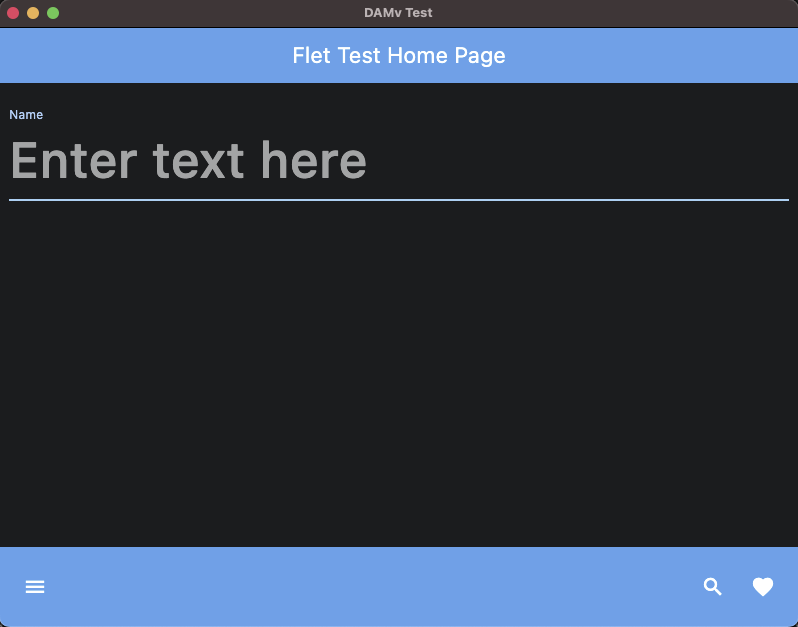
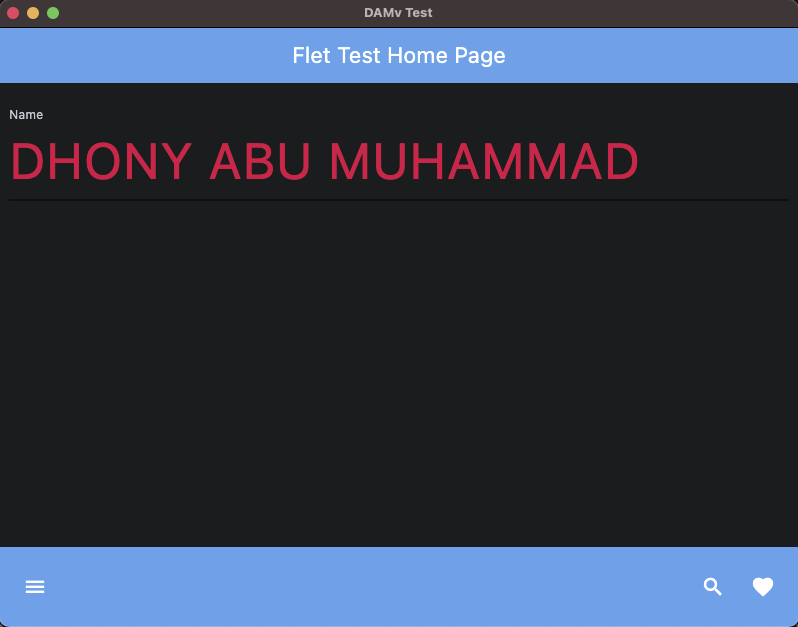
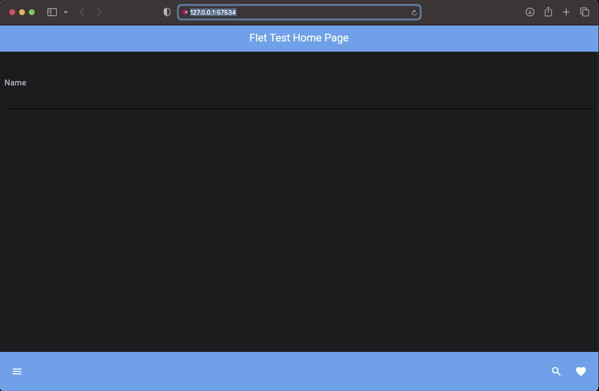
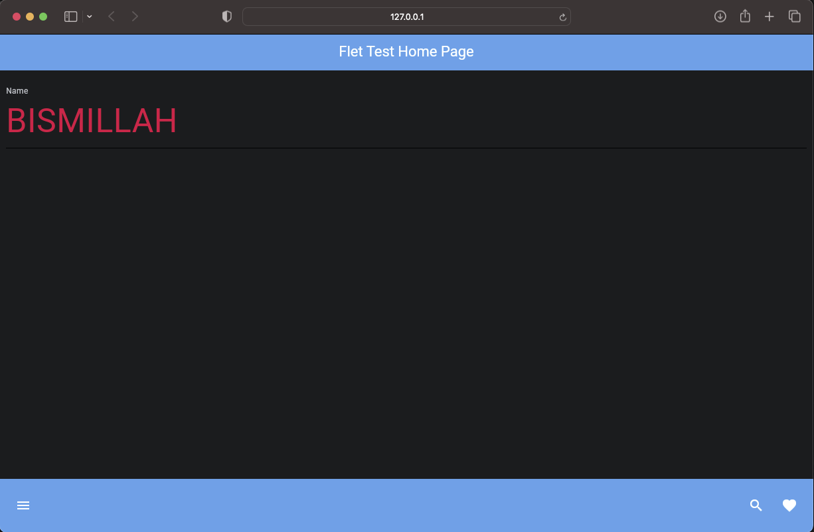

# Flet app Page Input with bottom_appbar run Local

### Begin Project :

    ❯ python -m venv venv

    ❯ source ./venv/bin/activate

    ❯ pip install flet

### Code :

    import flet as ft

    def main(page: ft.Page):
        page.title = "DAMv Test" 

        page.appbar = ft.AppBar(
            title=ft.Text("Flet Test Home Page", color=ft.colors.WHITE),  
            bgcolor=ft.colors.BLUE,  
            center_title=True  
        )

        text_field_name = ft.TextField(value="", 
                                label="Name",
                                hint_text="Enter text here", 
                                text_size=50,
                                color=ft.colors.RED,
                                border_color=ft.colors.BLUE_200, 
                                capitalization="characters",
                                border=ft.InputBorder.UNDERLINE)

        page.bottom_appbar = ft.BottomAppBar(
            bgcolor=ft.colors.BLUE,
            content=ft.Row(
                controls=[
                    ft.IconButton(icon=ft.icons.MENU, icon_color=ft.colors.WHITE),
                    ft.Container(expand=True),
                    ft.IconButton(icon=ft.icons.SEARCH, icon_color=ft.colors.WHITE),
                    ft.IconButton(icon=ft.icons.FAVORITE, icon_color=ft.colors.WHITE),
                ]
            ),
        )

        page.add(text_field_name)

        
    ft.app(target=main, view=ft.WEB_BROWSER)

### &#x1F3C3; Run :

command for deploy desktop app

    ❯ flet run main.py

        http://127.0.0.1:57071

    # or 

    ❯ flet main.py -d 

        http://127.0.0.1:57071

command for deploy web

    ❯ flet run --web main.py

        http://127.0.0.1:57534

    # or 

    ❯ flet main.py -w

        http://127.0.0.1:57534

### Result :

    

    

desktop apps

---

    

    

web

### Notes :

    ❯ flet --version

        0.21.1
