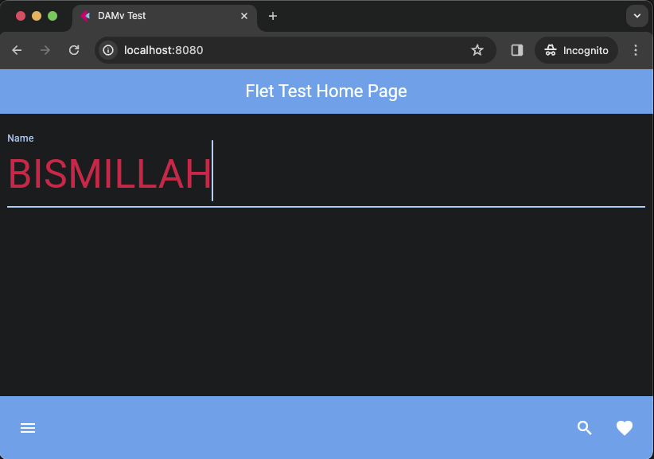

# Flet app Page Input with bottom_appbar run Docker container

### Code :

    import flet as ft

    def main(page: ft.Page):
        page.title = "DAMv Test" 

        page.appbar = ft.AppBar(
            title=ft.Text("Flet Test Home Page", color=ft.colors.WHITE),  
            bgcolor=ft.colors.BLUE,  
            center_title=True  
        )

        text_field_name = ft.TextField(value="", 
                                label="Name",
                                hint_text="Enter text here", 
                                text_size=50,
                                color=ft.colors.RED,
                                border_color=ft.colors.BLUE_200, 
                                capitalization="characters",
                                border=ft.InputBorder.UNDERLINE)

        page.bottom_appbar = ft.BottomAppBar(
            bgcolor=ft.colors.BLUE,
            content=ft.Row(
                controls=[
                    ft.IconButton(icon=ft.icons.MENU, icon_color=ft.colors.WHITE),
                    ft.Container(expand=True),
                    ft.IconButton(icon=ft.icons.SEARCH, icon_color=ft.colors.WHITE),
                    ft.IconButton(icon=ft.icons.FAVORITE, icon_color=ft.colors.WHITE),
                ]
            ),
        )

        page.add(text_field_name)

    ft.app(target=main,port=8080, view=None)

Notice the difference in the code section `ft.app(target=main,port=8080, view=None)`, this is to allow the application to be accessed from outside the container.

### &#x1F525; Build and run :

    ❯ docker build -t fletapp .

    ❯ docker run -d --name fletapp-avc -p 8080:8080 fletapp

    # list

    ❯ docker images

        REPOSITORY   TAG       IMAGE ID       CREATED         SIZE
        fletapp      latest    22ba225e25a8   9 seconds ago   143MB

    ❯ docker ps -a --format "table {{.ID}}\t{{.Image}}\t{{.Status}}\t{{.Names}}\t{{.Ports}}"

        CONTAINER ID   IMAGE     STATUS          NAMES         PORTS
        21761abc0de7   fletapp   Up 22 seconds   fletapp-avc   0.0.0.0:8080->8080/tcp 

### Result :

    

    

web | app container

### Notes : 

    ❯ docker --version

        Docker version 20.10.14, build a224086
